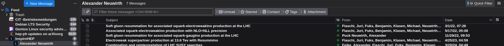

# inspire_hep_rss feed

This simple rust program queries the inspireHEP REST API and provides a RSS feed under e.g. http://127.0.0.1:3000/?sort=mostrecent&size=10&q=a%20Alexander.Neuwirth.1 following the options of the API https://github.com/inspirehep/rest-api-doc.

When adding the RSS feed to e.g. Thunderbird, please keep the update frequency low, like 1 update per day.

Below image shows the feed in Thunderbird.



Thus, it serves as a simple way to keep track of new publications of a given author.
Practically it is a subscribe to author feature, which is currently not available on inspireHEP.

## Install

```bash
cargo install inspire_hep_rss
inspire_hep_rss
```

starts the server on http://127.0.0.1:3000/ allowing only access from localhost.


## Configuration

```bash
crontab -e
```

And add the following line to the crontab file to start the server on boot/user login:

```
@reboot /home/YOURUSER/.cargo/bin/inspire_hep_rss
```

For more options (i.e. modifying the port, etc.) see the help:

```bash
inspire_hep_rss --help
```

## Development 

```bash
cargo run
```

to test it.

```bash
cargo build --release
```

produces a binary in `./target/release/inspire_hep_rss` which can be run on a server.

```
cp ./target/release/inspire_hep_rss ~/.local/bin/
```

and adjust the crontab path.
